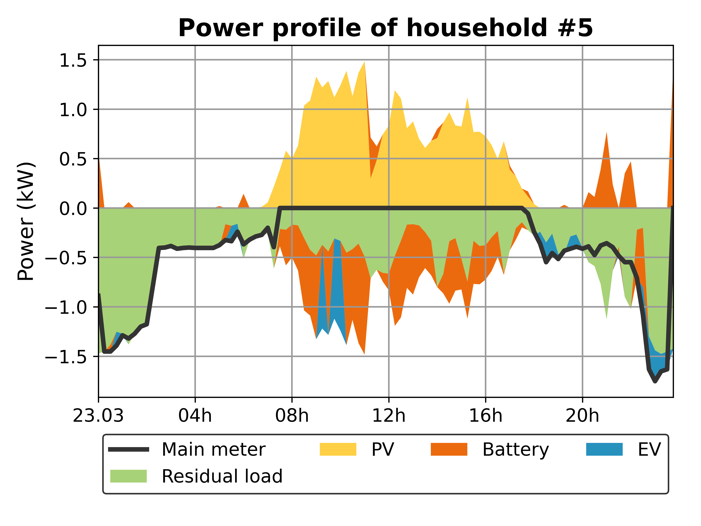
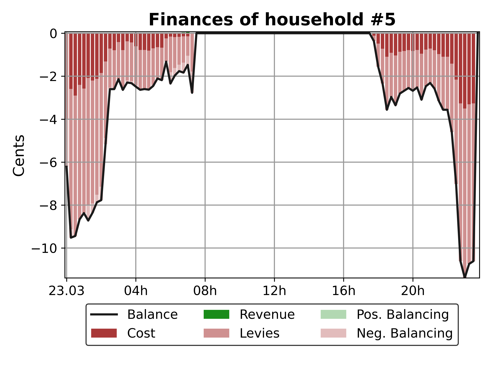

Agents
=================

The **Analyzer** allows users to visualize and interpret agent behavior in the simulation. The following figures provide key insights into agent-level energy consumption, generation, and market participation.

Agent-Level Visualizations
--------------------------

**1. Agent Energy Balance Over Time**
~~~~~~~~~~~~~~~~~~~~~~~~~~~~~~~~~~~~~

- This plot shows the total **energy consumption, generation, and net balance** of an individual agent over time.
- Positive values indicate excess generation (potential for export), while negative values indicate net consumption.
- Useful for assessing **self-sufficiency** and energy trading behavior.

**2. Agent Financial Balance Over Time**
~~~~~~~~~~~~~~~~~~~~~~~~~~~~~~~~~~~~~~~~~

- This plot illustrates the **financial balance** of an agent over time.
- Positive values indicate a surplus, while negative values indicate a deficit.
- Useful for understanding the financial implications of energy trading and consumption.