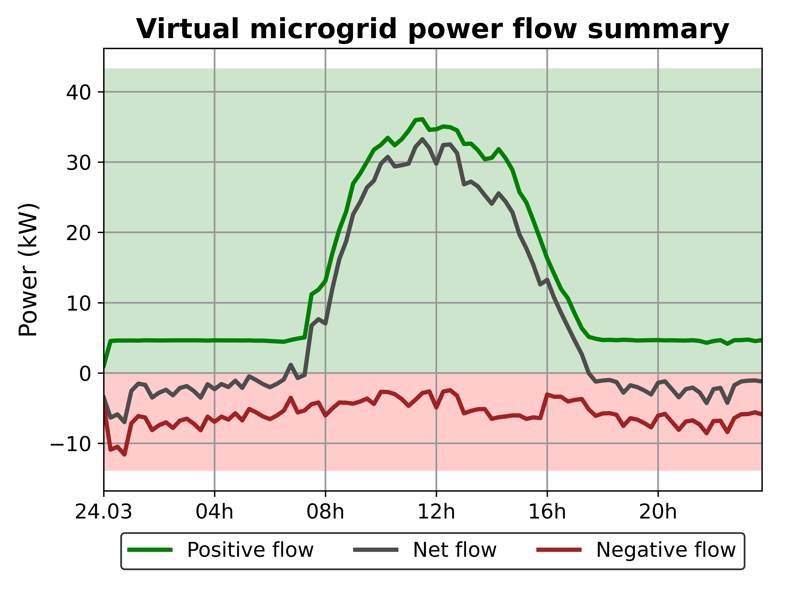

Grids
================

The **Analyzer** provides grid-level insights, including power flows, grid constraints, and the impact of market activities on grid stability. The following visualizations help assess **grid performance, bottlenecks, and flexibility needs**.

Grid-Level Visualizations
-------------------------

**1. Grid Load Over Time**
~~~~~~~~~~~~~~~~~~~~~~~~~~

- Displays the **total power demand** in the grid over time.
- Helps assess **peak demand periods** and potential grid congestion.
- Useful for evaluating how **renewable generation and flexible demand** affect grid stability.
