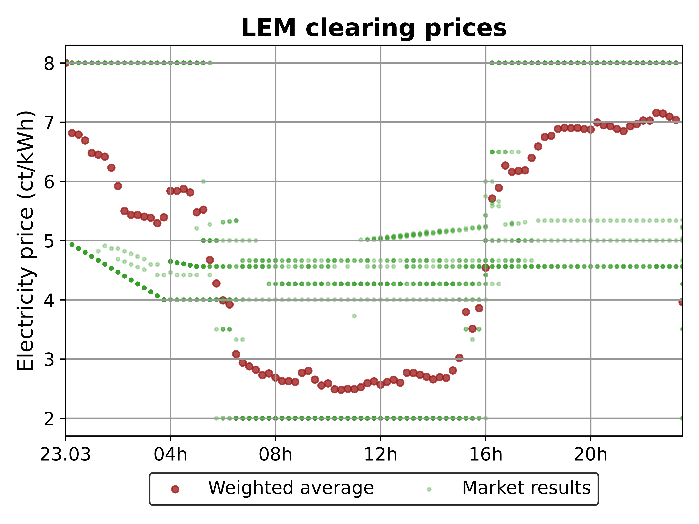
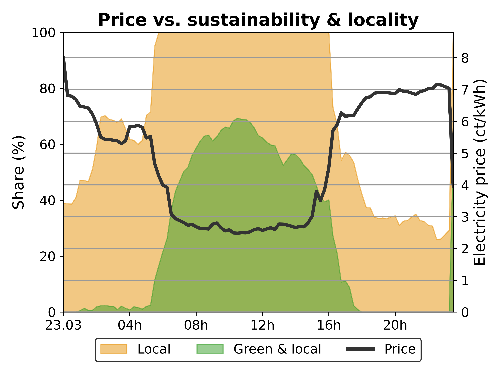

Markets
===================

The **Analyzer** provides market-level insights, including price formation, trading volumes, and market efficiency. The following visualizations help assess market performance and participant behavior.

Market-Level Visualizations
---------------------------

**1. Market Clearing Prices Over Time**
~~~~~~~~~~~~~~~~~~~~~~~~~~~~~~~~~~~~~~~

- Displays **clearing prices** in different markets over time.
- Helps assess **price volatility**, trends, and the impact of external factors such as renewable generation.
- Useful for analyzing **market efficiency and competitiveness**.

**2. Supply and Demand Curves**
~~~~~~~~~~~~~~~~~~~~~~~~~~~~~~~~~~~~~~~

- Shows the **bid and offer curves** for a given market clearing event.
- Helps understand **how supply and demand interact** and whether the market is well-matched.
- Indicates **market liquidity** and the potential for price manipulation.
