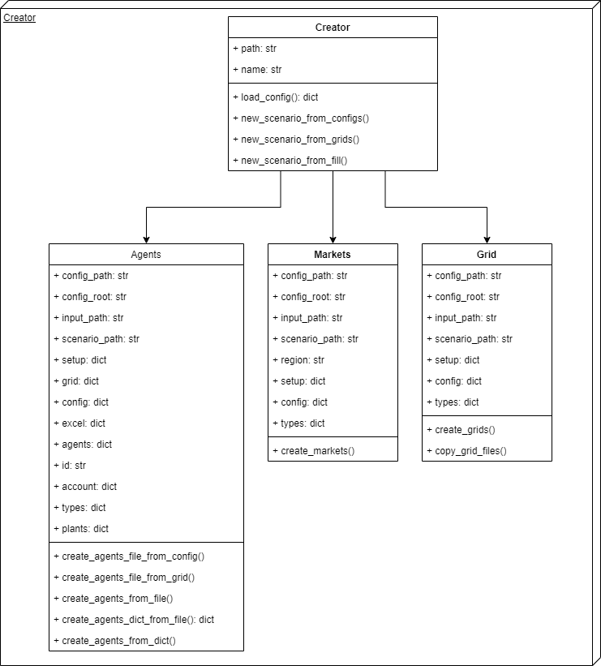
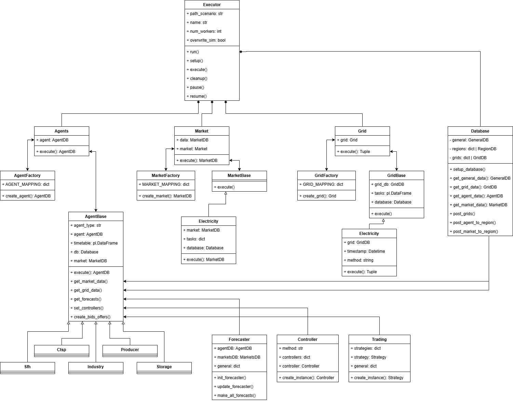
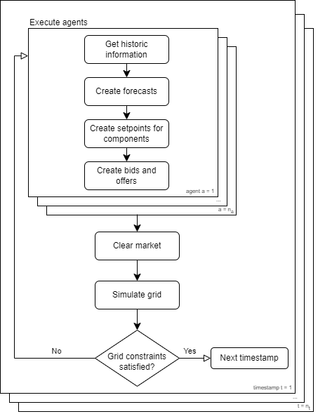

Architecture
===================

HAMLET is built on a modular architecture that enables flexibility, extensibility, and scalability in modeling decentralized energy systems. This section outlines its core components, data flow, and how users can extend its capabilities.

Overall Structure of HAMLET
---------------------------

HAMLET is organized into three main components, each responsible for a different aspect of the simulation:

1. **Creator**
   - Sets up the simulation environment by defining agents, markets, and grids.
   - Reads configuration files and initializes the required components.

2. **Executor**
   - Runs the simulation by executing interactions between agents, markets, and grids.
   - Manages the time-stepping mechanism and ensures data consistency across modules.

3. **Analyzer**
   - Processes and visualizes simulation results.
   - Allows users to extract insights from agent behaviors, market outcomes, and grid performance.

(image for analyzer yet to come)

Each of these components operates independently but exchanges data in a structured manner, ensuring smooth execution of scenarios.

Data Flow in a Typical Simulation
---------------------------------

A HAMLET simulation follows a structured workflow:

1. **Scenario Definition**
   - Users define agents, market rules, and grid properties using configuration files.
   - The Creator module parses and processes these configurations.

2. **Simulation Execution**
   - The Executor processes time steps sequentially or in parallel.
   - Agents make decisions based on available information and interact with markets.
   - Market mechanisms determine energy pricing, trading, and grid constraints.

3. **Results Processing**
   - Simulation outputs (e.g., energy consumption, market clearing prices, grid congestion) are recorded.
   - The Analyzer visualizes key performance indicators and facilitates post-simulation analysis.

HAMLET follows a **bottom-up approach**, where agents and markets dynamically interact instead of relying on a centralized optimization model.

Component Interactions
----------------------

HAMLET operates on three key elements:

1. **Agents**
   - Represent participants such as prosumers, industrial consumers, and grid operators.
   - Each agent follows a decision-making process influenced by its environment and objectives.

2. **Markets**
   - Facilitate transactions between agents.
   - Different market mechanisms (e.g., auctions, bilateral trades) can be implemented.

3. **Grids**
   - Ensure technical feasibility by simulating energy flows.
   - Consider network constraints, grid topology, and power balance.

These components interact in every simulation step to dynamically adjust energy trading, grid constraints, and agent strategies.

Extensibility and Customization
-------------------------------

HAMLET is designed for flexibility, allowing users to modify and expand its core functionalities:

- **Adding New Agent Behaviors**
  - Users can define custom agent strategies to reflect unique decision-making processes.

- **Modifying Market Mechanisms**
  - New pricing models, auction types, and trading rules can be implemented.

- **Custom Grid Models**
  - HAMLET supports extending grid models to incorporate additional constraints or optimization features.

By structuring the system in a modular way, HAMLET enables researchers and engineers to tailor simulations to their specific needs.
